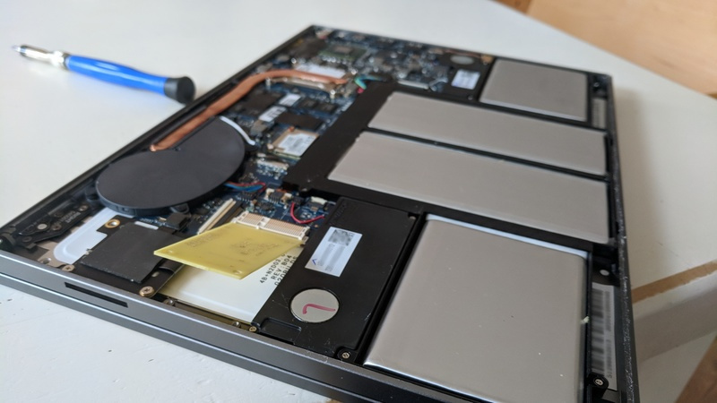
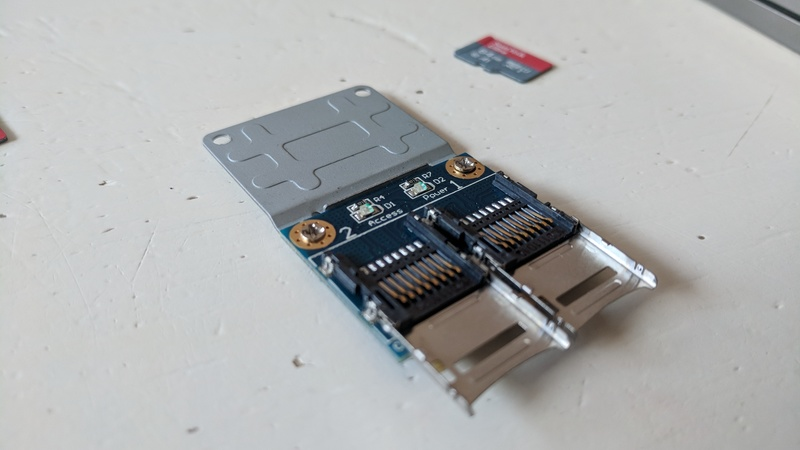
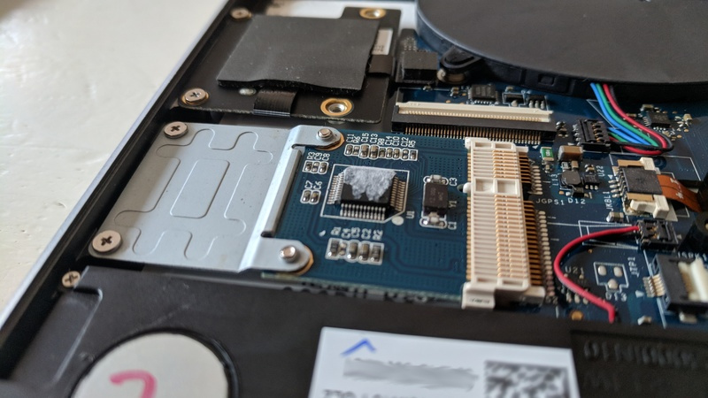

# Linux on Chrome Book Pixel

**Chrome Book Pixel** (Link / 2013) Linux setup with coreboot BIOS, **more storage** and a light weight WM (XFCE4).

NOTE: Don't mind me if you brick your machine :)

<!-- TOC -->

- [Linux on Chrome Book Pixel](#linux-on-chrome-book-pixel)
  - [Preparation](#preparation)
    - [Remove ChromeOS](#remove-chromeos)
    - [BIOS](#bios)
    - [Expand your Hard Drive Capacity](#expand-your-hard-drive-capacity)
      - [Remove LTE Dummy Slot](#remove-lte-dummy-slot)
      - [Inserd SD Adapter](#inserd-sd-adapter)
      - [Expand with 2 SD Cards](#expand-with-2-sd-cards)
      - [Benchmarks](#benchmarks)
  - [Antergos](#antergos)
    - [Kernel parameter](#kernel-parameter)
    - [libinput-gestures](#libinput-gestures)
    - [Tweaks](#tweaks)
      - [Theme & Icons](#theme-icons)
      - [Fonts](#fonts)
      - [Cursor](#cursor)
      - [Power Management](#power-management)
      - [Keyboard](#keyboard)
      - [Compositor](#compositor)
      - [lightdm](#lightdm)
      - [Backlight Brightness](#backlight-brightness)
      - [Samba Shares](#samba-shares)
  - [GalliumOS](#galliumos)
    - [libinput](#libinput)
    - [Keyboard](#keyboard)
    - [Disable bluetooth](#disable-bluetooth)
    - [WIFI](#wifi)
    - [Tweaks](#tweaks)
      - [Font-size at lightdm](#font-size-at-lightdm)
  - [More](#more)

<!-- /TOC -->

## Preparation

### Remove ChromeOS

* Set ChromeOS into Dev mode
* Remove existing ChromeOS
* Tutorial: https://mrchromebox.tech/#devmode

### BIOS

* Remove BIOS Protection HW Screw
  * https://www.ifixit.com/Guide/Remove+the+Write+Protect+Screw/86362
* Replace BIOS
  * https://mrchromebox.tech/#fwscript
  * Install custom coreboot firmware (Full ROM)

### Expand your Hard Drive Capacity

Add more storage to the Chromebook Pixel!

* mSATA doesn't work :(
  * https://www.youtube.com/watch?v=x0_u8bjQFzg

Replace "LTE Dummy Slot" with "Mini PCIe Memory Card Adapter"
  * https://www.amazon.de/gp/product/B01AOVJ456/ref=oh_aui_detailpage_o04_s00?ie=UTF8&psc=1

#### Remove LTE Dummy Slot



#### Inserd SD Adapter



#### Expand with 2 SD Cards



#### Benchmarks

```shell
sudo hdparm -Tt /dev/sda
```

* /dev/sda:
  * Timing cached reads:   7618 MB in  2.00 seconds = 3816.76 MB/sec
  * Timing buffered disk reads: 1394 MB in  3.00 seconds = 464.49 MB/sec
* /dev/sdb:
  * Timing cached reads:   8574 MB in  2.00 seconds = 4297.24 MB/sec
  * Timing buffered disk reads:  52 MB in  3.04 seconds =  17.12 MB/sec
* /dev/sdc:
  * Timing cached reads:   8398 MB in  2.00 seconds = 4208.85 MB/sec
  * Timing buffered disk reads:  52 MB in  3.06 seconds =  16.97 MB/sec

Slow, but enough storage!

## Antergos

- Install OS: https://antergos.com/
- Boot Manager: systemd-boot

### Kernel parameter

- https://wiki.archlinux.org/index.php/Chrome_OS_devices#With_kernel_parameters
- /boot/loader/entries/antergos.conf

```
# /boot/loader/entries/antergos.conf
options tpm_tis.force=1 tpm_tis.interrupts=0
options pcie_aspm=off pci=noaer libata.noacpi=1
```

### libinput-gestures

* Install "libinput-gestures"
  * libinput-gestures-setup 
* Configure
  * conf/libinput-gestures.conf

### Tweaks

#### Theme & Icons

* Appearance
  * Style
    * Adapta-Eta
  * Icons
    * Numix
* Windows Manager
  * Style
    * Adapta
    * Title Font
      * Roboto 8
* qt5ct
  * Style
    * gtk2
  * Fonts
    * Roboto Regular 10
  * Icon Theme
    * Numix

#### Fonts

* Settings
  * Appearance
    * Roboto 10 (Install)
    * Custom DPI Settings: 168

#### Cursor

* Install
  * capitaine-cursors
* Settings
  * Mouse & Touchpad
    * Theme
      * Capitaine Cursors
      * Cursor Size: 38
      * (a bit large, but... )

#### Power Management

Install & enable TLP tools:

```shell
sudo pacman -S tlp tlp-rdw
sudo systemctl enable tlp
sudo systemctl enable tlp-sleep
```

#### Keyboard

"de" for a German keymap, replace with your flavor:

```shell
localectl set-x11-keymap de chromebook
```

#### Compositor

- Disable XFCE Compositor
  - Settings  
  - Window Manager Tweaks
  - Disable
- Install compton
  - Autostart
  - cp conf/compton.desktop ./config/autostart/

#### lightdm

* Install lightdm-gtk-greeter
* /etc/lightdm/lightdm.conf 
  * greeter-session=lightdm-gtk-greeter
  * greeter-show-manual-login = true
  * greeter-hide-users = true
  * greeter-allow-guest=false
  * allow-guest = false
* lightdm-gtk-greeter settings
    * Appearance
      * Additional font options
        * DPI: 150
        * Font: Roboto Regular
        * Theme / Icons ...

#### Backlight Brightness

* Install
  * https://github.com/wavexx/acpilight
* Add user to video group
  * sudo gpasswd -a $USER video
* add udev rule
  * /etc/udev/rules.d/90-backlight.rules
* sudo cp bin/brightness /usr/local/bin
* Settings
  * Keyboard
    * Add Rule for Display
      * /usr/local/bin/brightness up intel_backlight
      * /usr/local/bin/brightness down intel_backlight
    * Add Rule for Keyboard
      * /usr/local/bin/brightness up chromeos::kbd_backlight
      * /usr/local/bin/brightness down chromeos::kbd_backlight

#### Samba Shares

"gvfs-smb" for Thunar.

## GalliumOS

My first try, but I've problems with WIFI.

As describted at https://mrchromebox.tech, I tried 2.2:

* https://galliumos.org/releases/nightly/galliumos-braswell-xenon-20171227T072217Z.iso

### libinput

```shell
sudo apt install xserver-xorg-input-libinput
sudo mkdir /etc/X11/xorg.conf.d/
sudo nano /etc/X11/xorg.conf.d/30-touchpad.conf
```

```
Section "InputClass"
  Identifier "MyTouchpad"
  MatchIsTouchpad "on"
  Driver "libinput"
  Option "Tapping" "on"
EndSection
```

Tmp fix:
* https://github.com/raphael/linux-samus/issues/195

```
xinput set-prop 11 277 1
```

### Keyboard

Keyboard, Layout, Chromebook (most models), No overlay

### Disable bluetooth

```shell
sudo apt-get install dconf
dconf-editor
navigate to org.blueman.plugins.powermanager
set "auto-power-on" to "false"
```

### WIFI

GalliumOS lost connectivity :(

* https://github.com/GalliumOS/galliumos-distro/issues/253

At this moment, no fix.

### Tweaks

#### Font-size at lightdm

* dpi setting // font

something like:
```
# /etc/lightdm/lightdm.conf.d/dpi.conf
[SeatDefaults]
xserver-command=X -dpi 168
```

## More

- https://wiki.archlinux.org/index.php/Chrome_OS_devices#With_kernel_parameters
- https://wiki.gentoo.org/wiki/Google_Chromebook_Pixel_LTE
- https://github.com/longsleep/pixel-linux